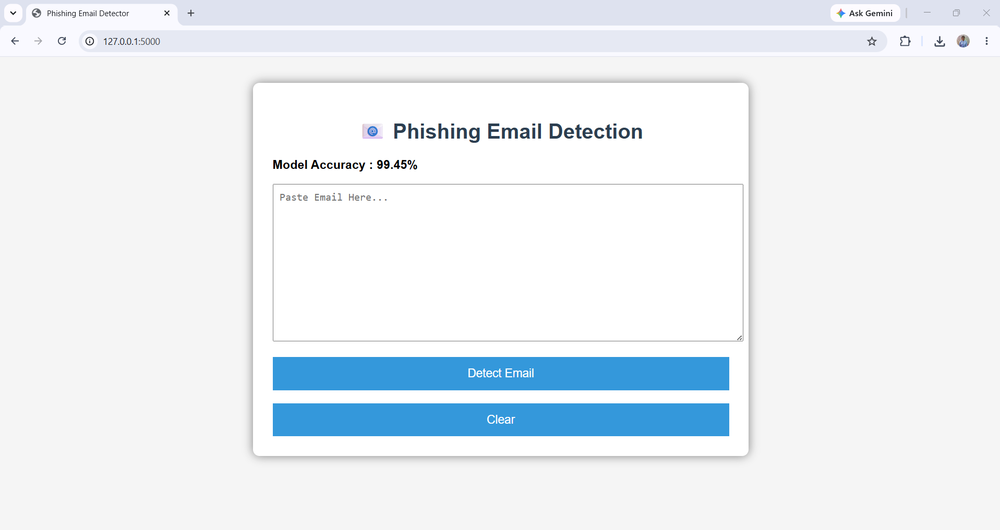
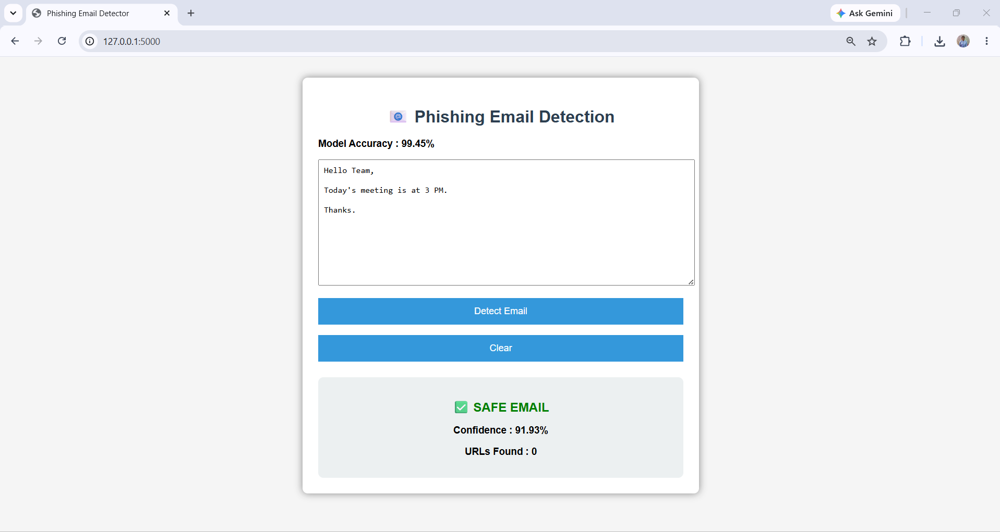
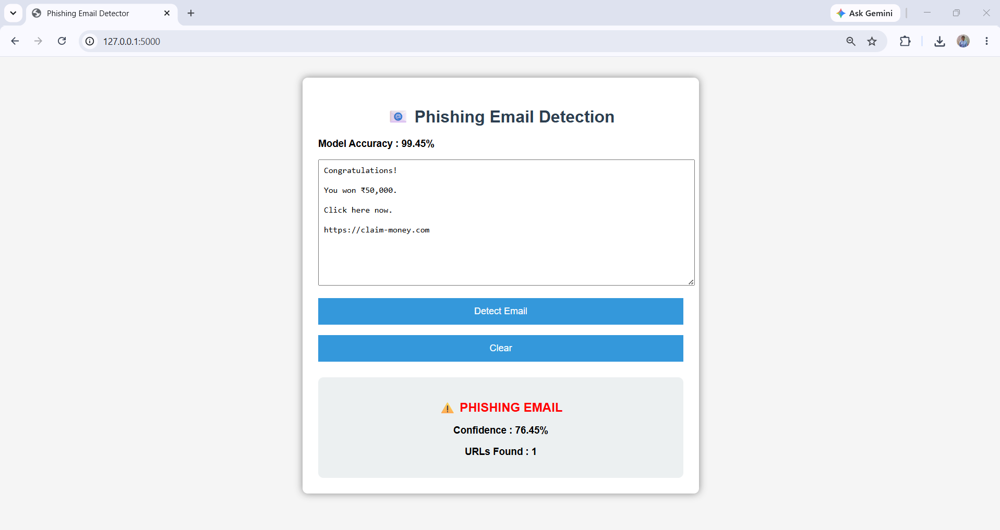
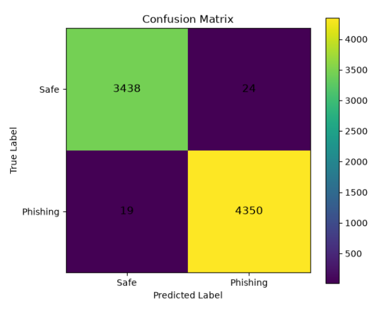

# 🛡️ Phishing Email Detection using Machine Learning

## 📌 Project Overview

Phishing emails are fraudulent emails designed to trick users into revealing sensitive information such as passwords, bank account details, OTPs, and personal data.

This project uses **Machine Learning** to classify emails as **Safe** or **Phishing** based on their textual content and the number of URLs present in the email.

A trained **Logistic Regression** model with **TF-IDF Vectorization** is used for classification, and a simple **Flask Web Application** provides an easy-to-use interface.

---

# 🎯 Objectives

- Detect phishing emails automatically.
- Reduce the risk of cyber attacks.
- Learn Machine Learning for cybersecurity.
- Build a simple Flask web application.

---

# ✨ Features

- Detects Safe and Phishing emails
- TF-IDF text feature extraction
- URL count feature
- Logistic Regression classifier
- Confidence score
- Web interface using Flask
- Confusion Matrix
- Classification Report

---

# 🛠️ Technologies Used

| Category | Technology |
|-----------|------------|
| Programming Language | Python 3 |
| Machine Learning | Scikit-learn |
| Data Processing | Pandas, NumPy |
| Web Framework | Flask |
| Frontend | HTML, CSS |
| Model Saving | Joblib |
| Visualization | Matplotlib |

---

# 📂 Project Structure

```text
Phishing_Email_Detection
│
├── dataset/
│   ├── emails.csv
│   └── processed/
│       └── cleaned_emails.csv
│
├── model/
│   ├── phishing_model.pkl
│   └── vectorizer.pkl
│
├── screenshots/
│   ├── home.png
│   ├── safe_result.png
│   ├── phishing_result.png
│   └── confusion_matrix.png
│
├── static/
│   └── style.css
│
├── templates/
│   └── index.html
│
├── app.py
├── predict.py
├── preprocess.py
├── train_model.py
├── requirements.txt
└── README.md
```

---

# ⚙️ Machine Learning Workflow

```
Dataset
     ↓
Data Cleaning
     ↓
TF-IDF Feature Extraction
     ↓
Train/Test Split
     ↓
Logistic Regression
     ↓
Prediction
     ↓
Flask Web Application
```

---

# 🧠 Machine Learning Algorithm

- Logistic Regression

### Why Logistic Regression?

- Fast
- Lightweight
- High Accuracy
- Suitable for Text Classification
- Easy to understand

---

# 📊 Features Used

- Email Text
- URL Count

---

# 📈 Model Evaluation

The model was evaluated using:

- Accuracy
- Precision
- Recall
- F1-Score
- Confusion Matrix

---

# 🖥️ Application Screenshots

## Home Page



---

## Safe Email Detection



---

## Phishing Email Detection



---

## Confusion Matrix



---

# 🚀 Installation

## Clone Repository

```bash
git clone https://github.com/nalawadeshravani202/Phishing-Email-Detection.git
```

---

## Go to Project Folder

```bash
cd Phishing-Email-Detection
```

---

## Install Dependencies

```bash
pip install -r requirements.txt
```

---

## Run the Application

```bash
python app.py
```

---

## Open Browser

```
http://127.0.0.1:5000
```

---

# 📌 Example Predictions

### Example 1

Input

```
Congratulations!

You won ₹50,000.

Click here:

https://claim-prize.com
```

Prediction

```
PHISHING
```

---

### Example 2

Input

```
Hello Team,

Tomorrow's meeting is at 11 AM.

Thank you.
```

Prediction

```
SAFE
```

---

# 🔮 Future Improvements

- Deep Learning models (LSTM/BERT)
- Email attachment analysis
- Browser extension
- Real-time email scanning
- Database for prediction history
- User authentication

---

# 👩‍💻 Author

**Shravani Nalawade**

Diploma in Information Technology

Machine Learning & Cybersecurity Enthusiast

GitHub:
https://github.com/nalawadeshravani202

---

# ⭐ If you like this project

Please consider giving it a ⭐ on GitHub.